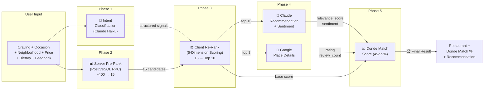
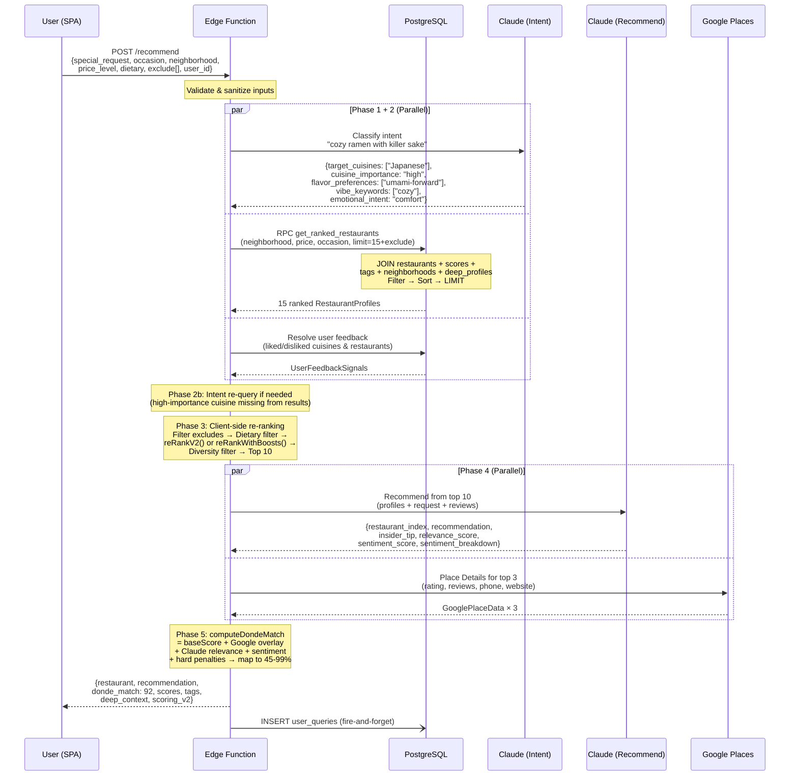
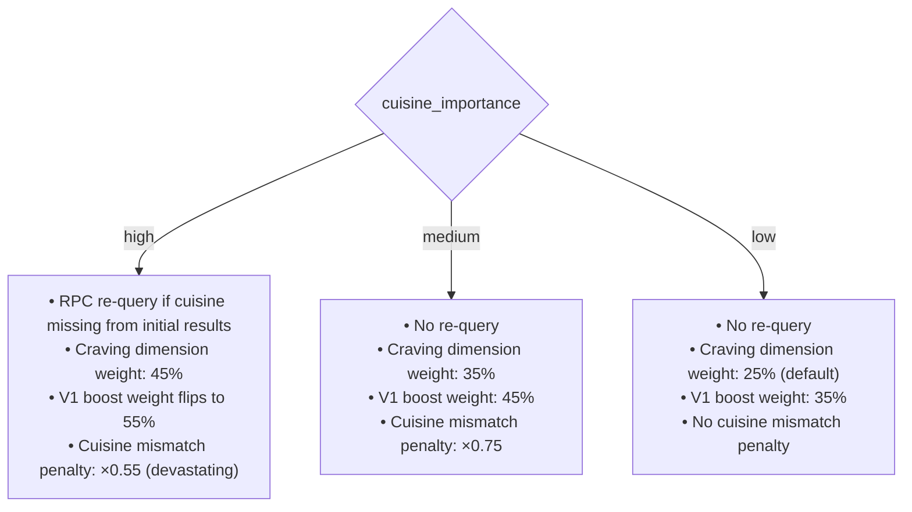
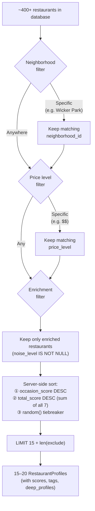
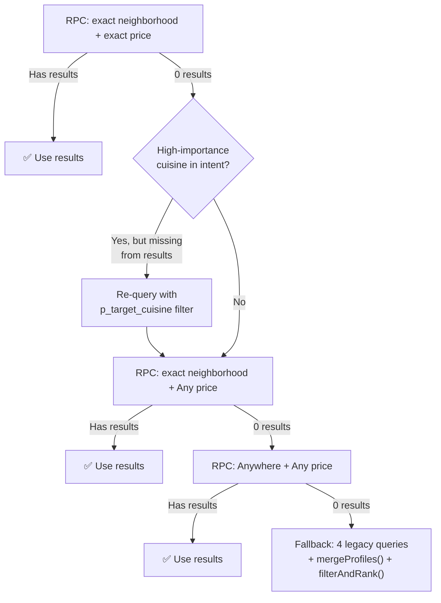
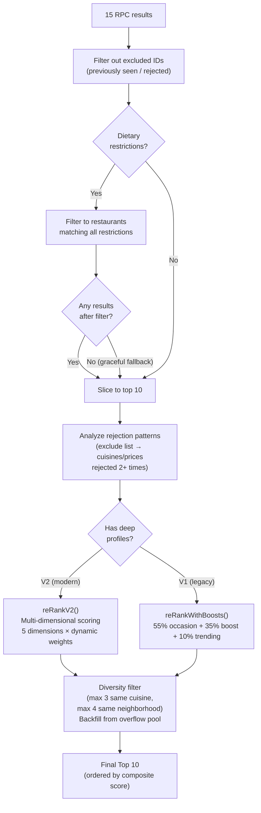
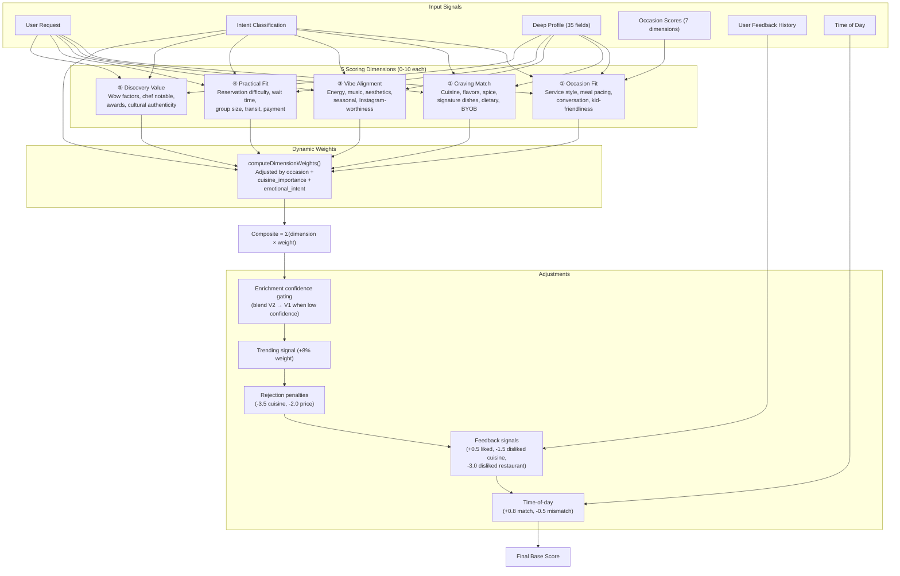
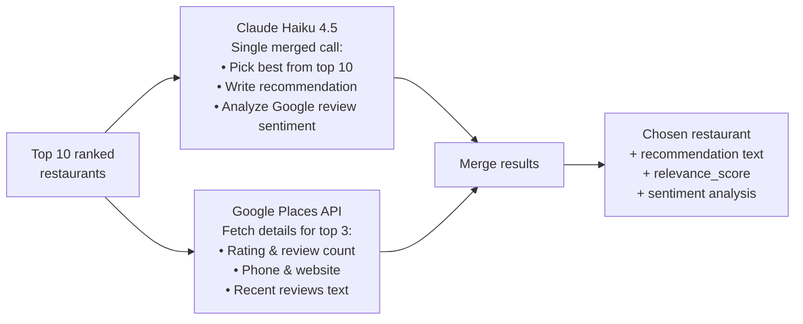
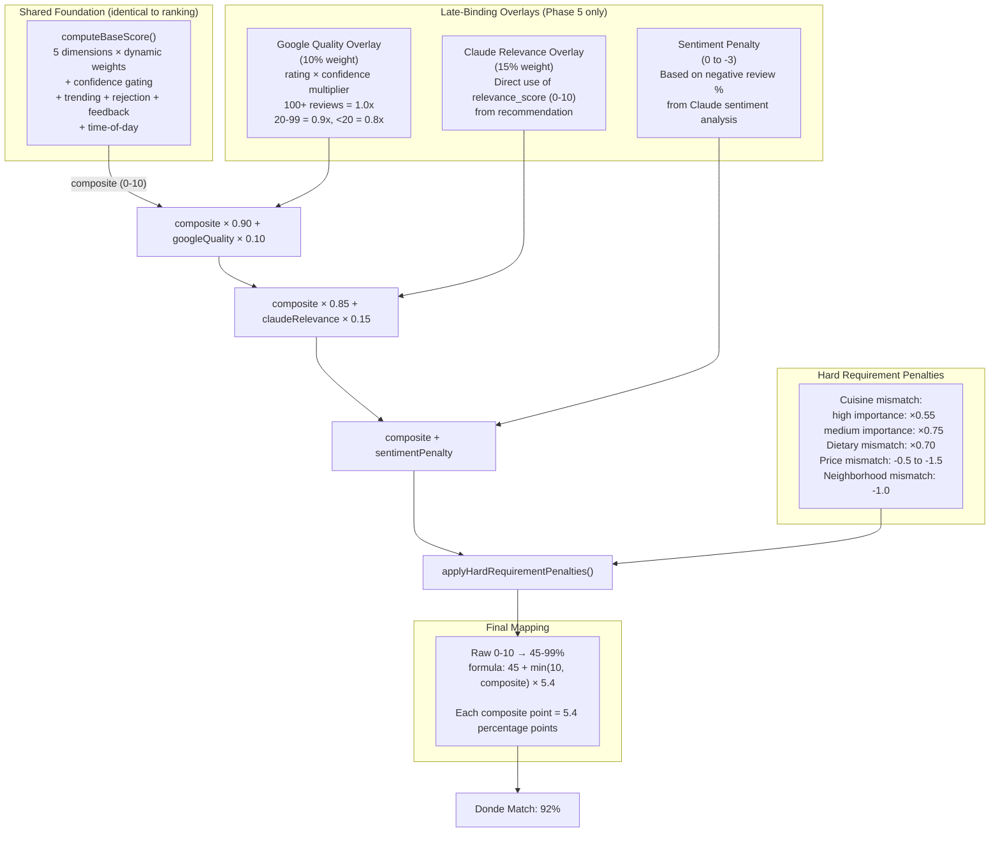
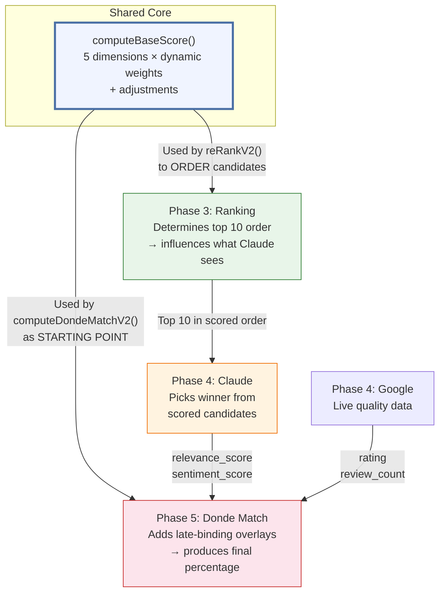

# Donde Match & Recommendation Engine — Design Document

> How the matching score and recommendation engine work hand-in-hand to rank the best restaurant for every user request.

---

## 1. Executive Summary

Donde Match is the confidence percentage (45–99%) displayed to users that answers: **"How well does this restaurant fit what you asked for?"** It is the product of a multi-phase pipeline where a scoring engine and an AI recommendation engine collaborate to surface the single best restaurant from hundreds of candidates.

The pipeline works in five phases:

1. **Intent Classification** — Claude AI parses the user's free-text craving into structured signals (cuisine, flavor, vibe, emotional intent)
2. **Server-Side Pre-Ranking** — A PostgreSQL RPC function filters and sorts ~400+ restaurants down to 15 candidates using occasion scores
3. **Client-Side Re-Ranking** — A multi-dimensional scoring engine (5 dimensions, dynamic weights) re-orders the top 10 based on the user's full context
4. **Claude Recommendation** — Claude selects the best match from the top 10 and writes a personalized recommendation with sentiment analysis
5. **Donde Match Computation** — The same scoring core is augmented with late-binding signals (Google quality, Claude relevance, sentiment) to produce the final percentage

The key architectural insight: **ranking and match scoring share the exact same `computeBaseScore()` function**. The ranking determines which restaurants Claude sees; Claude's pick and assessment then flow back into the match score as late-binding overlays. This creates a coherent system where the recommendation and the confidence score are fundamentally aligned.

### High-Level Pipeline



### Match Score Tiers

| Range | Tier | Meaning |
|-------|------|---------|
| 90–99% | Outstanding | Near-perfect fit for your request |
| 85–89% | Excellent | Strong match on most dimensions |
| 75–84% | Solid Pick | Good match with minor trade-offs |
| 60–74% | Worth a Try | Partial match, but has appeal |
| 45–59% | Adventurous | Outside your usual, but worth considering |

---

## 2. End-to-End Process Flow

The following sequence diagram shows every actor and the data flowing between them during a single recommendation request.



---

## 3. Phase 1 — Intent Classification

**When:** Runs in parallel with the RPC query (adds no latency to critical path)
**Cost:** ~150 input tokens + ~100 output tokens per request
**Latency:** 200–400ms

The intent classifier converts a free-text `special_request` like _"cozy ramen with killer sake"_ into structured search signals that guide both re-ranking and match scoring.

### V2 Intent Fields

| Field | Type | Example | Used By |
|-------|------|---------|---------|
| `target_cuisines` | string[] | `["Japanese"]` | Craving Match, RPC re-query |
| `cuisine_importance` | high / medium / low | `"high"` | Dynamic weights, intent re-query, penalties |
| `target_tags` | string[] | `["craft cocktails"]` | Keyword boost, tag matching |
| `target_features` | string[] | `["outdoor_seating"]` | Feature matching |
| `flavor_preferences` | string[] | `["umami-forward", "rich"]` | V2 Craving Match dimension |
| `vibe_keywords` | string[] | `["cozy", "intimate"]` | V2 Vibe Alignment dimension |
| `practical_constraints` | string[] | `["walk-in"]` | V2 Practical Fit dimension |
| `emotional_intent` | string | `"comfort"` | Dynamic weight adjustment |
| `date_type` | string \| null | `"first_date"` | Occasion fit refinement |
| `group_size_hint` | string \| null | `"couple"` | Practical fit, group matching |
| `spontaneity` | planned / spontaneous / unknown | `"spontaneous"` | Reservation difficulty scoring |

### Cuisine Importance Downstream Impact



> **Source:** `intent-classifier.ts` — V2 intent prompt + `scoring.ts:1703-1764` — dynamic weights

---

## 4. Phase 2 — Server-Side Pre-Ranking (RPC)

A single PostgreSQL RPC call (`get_ranked_restaurants`) replaces what was originally 4 separate queries. It performs server-side JOINs, filtering, and sorting in one round-trip.

### Filter → Sort → Limit Funnel



### Relaxation Cascades

When the initial query returns too few results, the system progressively relaxes constraints:



> **Source:** `index.ts:262-366` — RPC calls + relaxation logic

---

## 5. Phase 3 — Client-Side Re-Ranking

After the RPC returns ~15 candidates, the Edge Function applies intelligent re-ranking using the full context of the user's request (including intent classification, feedback history, time-of-day, and rejection patterns).

### Re-Ranking Pipeline



### V2 Multi-Dimensional Scoring Engine

The V2 scoring engine evaluates each restaurant across **5 independent dimensions**, then combines them using **dynamically weighted** composition.



### Dimension Details

#### Dimension 1: Occasion Fit (0-10)

Starts with a **weighted blend** of 7 database score columns based on the occasion:

| Occasion | Formula |
|----------|---------|
| Date Night | 100% `date_friendly_score` |
| Group Hangout | 100% `group_friendly_score` |
| Family Dinner | 100% `family_friendly_score` |
| Business Lunch | 100% `business_lunch_score` |
| Solo Dining | 100% `solo_dining_score` |
| Special Occasion | 70% `romantic_rating` + 30% `date_friendly_score` |
| Treat Myself | 50% `solo_dining_score` + 30% `romantic_rating` + 20% `hole_in_wall_factor` |
| Adventure | 60% `hole_in_wall_factor` + 20% `group_friendly_score` + 20% `solo_dining_score` |
| Chill Hangout | 60% `group_friendly_score` + 30% `solo_dining_score` + 10% `hole_in_wall_factor` |
| Any | Average of all 7 |

**Deep profile enhancements:**
- **Service style alignment** (+0.5 match, -0.3 mismatch) — e.g., "Tasting Menu" ideal for "Special Occasion"
- **Meal pacing fit** (+0.3) — e.g., "leisurely" ideal for "Date Night"
- **Conversation friendliness** (±0.5) — bonus for talk-dependent occasions (Date Night, Business Lunch)
- **Kid friendliness** (±0.75) — bonus for Family Dinner

#### Dimension 2: Craving Match (0-10)

Semantic matching against the user's food intent. Scored across 7 levels:

| Level | Points | What It Matches |
|-------|--------|----------------|
| Cuisine match | 0–4 | Intent `target_cuisines` vs `cuisine_type` (exact=4, subcategory=3) |
| Flavor profile | 0–3 | Intent `flavor_preferences` vs deep profile `flavor_profiles` |
| Spice level | 0–1 | Request keywords vs deep profile `spice_level` |
| Signature dish | 0–2 | Request words vs deep profile `signature_dishes[].dish` |
| Tag + feature | 0–3 | Keyword → tag/feature matching |
| Dietary depth | 0–2 | `dietary_depth`: dedicated(2) / solid(1.5) / token(0.5) |
| BYOB | 0–1 | "byob" in request + `byob_policy: "full_byob"` |

Raw score is normalized: `(score / maxScore) × 10`

#### Dimension 3: Vibe Alignment (0-10)

Evaluates atmosphere fit across energy, music, aesthetics, and seasonal factors:

- **V1 base** (scaled to 0-5): noise level, lighting, dress code for occasion
- **Energy level** (0–2): Restaurant `energy_level` vs occasion-appropriate range

  | Occasion | Ideal Energy Range |
  |----------|-------------------|
  | Date Night | 4–7 |
  | Group Hangout | 6–9 |
  | Business Lunch | 2–5 |
  | Adventure | 4–10 |

- **Music vibe** (0–1): Music type vs occasion fit (e.g., live-jazz for Date Night)
- **Intent vibe matching** (0–1.5): User's `vibe_keywords` vs `decor_style`, `music_vibe`, `energy_level`
- **Aesthetic matching** (0–2.5): Instagram-worthiness, cultural authenticity, elegance, coziness
- **Seasonal relevance** (±0.2): Time-of-year scoring

#### Dimension 4: Practical Fit (0-10)

Starts at 8 (assume practical until proven otherwise), then adjusts:

- **Reservation difficulty** (-3 if hard-to-get + spontaneous request; +1 if walk-in + spontaneous)
- **Meal pacing mismatch** (-2 if ceremonial + Business Lunch, or quick_bite + Date Night)
- **Group size** (-2 if large group + small sweet spot; -1 if solo + group-oriented)
- **BYOB match** (+1.5)
- **Cash-only penalty** (-0.5)

#### Dimension 5: Discovery Value (0-10)

Measures how interesting/notable the restaurant is:

- **Wow factors** (+0.7 per factor, max +2)
- **Origin story** (+0.5)
- **Unique selling point** (+1)
- **Hidden local gem** (+2 for Adventure)
- **Destination restaurant** (+1 for Special Occasion)
- **Awards** (+1.5 for Special Occasion / Treat Myself)
- **Cultural authenticity ≥ 8** (+1 for Adventure)
- **Chef notable** (+0.5 for Special Occasion / Treat Myself)
- **Emotional intent modulation**: "explore" boosts hidden gems; "impress" boosts awards

### Dynamic Weight Tables

Weights shift based on occasion and intent to emphasize what matters most:

**By Cuisine Importance:**

| Scenario | Occasion | Craving | Vibe | Practical | Discovery |
|----------|----------|---------|------|-----------|-----------|
| Default (low importance) | 25% | 25% | 20% | 15% | 15% |
| High cuisine importance | 15% | **45%** | 15% | 15% | 10% |
| Medium cuisine importance | 20% | **35%** | 20% | 15% | 10% |

**By Occasion (when cuisine importance is low):**

| Occasion | Occasion | Craving | Vibe | Practical | Discovery |
|----------|----------|---------|------|-----------|-----------|
| Date Night / Special Occasion / Business Lunch | **30%** | 10% | **30%** | 15% | 15% |
| Adventure | 10% | 20% | 15% | 15% | **40%** |
| Family Dinner | 25% | 20% | 15% | **25%** | 15% |

**By Emotional Intent (fine-tuning):**

| Intent | Effect |
|--------|--------|
| `explore` | Discovery +10%, Occasion -5%, Craving -5% |
| `comfort` | Vibe +5%, Discovery -5% |
| `impress` | Occasion +5%, Discovery +5%, Practical -5%, Craving -5% |

Weights are normalized to sum to 1.0 after all adjustments.

### Composite Score Formula

```
composite = Σ(dimension[i] × weight[i])    // 5 dimensions

// Enrichment confidence gating (when deep profile confidence < 7/10)
if (confidence < 7):
    composite = composite × (confidence/10) + v1Base × (1 - confidence/10)

// Trending signal
composite = composite × 0.92 + (trending/10) × 0.08

// Rejection penalties (from "Try Another" pattern analysis)
if (cuisine rejected 2+ times):  composite -= 3.5
if (price rejected 2+ times):    composite -= 2.0

// User feedback personalization
if (liked cuisine):     composite += 0.5
if (disliked cuisine):  composite -= 1.5
if (disliked restaurant): composite -= 3.0

// Time-of-day signals
if (best_times matches): composite += 0.8
if (narrow-focus mismatch): composite -= 0.5
```

> **Source:** `scoring.ts:1823-1884` — `computeBaseScore()`, `scoring.ts:1703-1764` — `computeDimensionWeights()`

---

## 6. Phase 4 — Claude Recommendation Engine

After re-ranking produces the top 10 candidates, Claude AI makes the final selection and generates a personalized recommendation.

### What Happens in Parallel



### Claude's Input

Claude receives a prompt containing:
1. **System prompt** with occasion context and personality guidelines (prompt-cached)
2. **Top 10 restaurant profiles** — all attributes, scores, tags, deep profile fields
3. **User's request** — special_request, occasion, price_level
4. **Google reviews** — pre-fetched for top 3 candidates (inlined in prompt)

### Claude's Output

| Field | Type | Purpose |
|-------|------|---------|
| `restaurant_index` | 0–9 | Which of the top 10 Claude picks |
| `recommendation` | string | 2–3 sentence personalized pitch |
| `insider_tip` | string | One insider tip about the restaurant |
| `relevance_score` | 0–10 | Claude's assessment of fit (feeds into Donde Match) |
| `sentiment_score` | 0–10 | Aggregate sentiment from Google reviews |
| `sentiment_breakdown` | string | Positive / negative / neutral summary |

### Closed Restaurant Auto-Substitution

If Google data reveals the chosen restaurant is `CLOSED_PERMANENTLY`, the system automatically substitutes the next highest-ranked candidate and recomputes the match score.

### Prompt Caching

The system prompt uses `cache_control: { type: "ephemeral" }` to enable Anthropic's prompt caching, reducing cost and latency for repeated requests with the same occasion type.

> **Source:** `index.ts` — Claude call orchestration, `claude.ts` — API client

---

## 7. Phase 5 — Donde Match Score Computation

The Donde Match percentage is the culminating signal — it takes the **same base score used for ranking** and augments it with information that only becomes available after Claude and Google respond.

### Donde Match Computation Flow



### Score Influence Breakdown

After all overlays, the base score retains **~76.5%** of influence on the final number:

```
Base score influence:     76.5%   (0.90 × 0.85 = 0.765)
Google quality overlay:   10.0%   (live rating + review confidence)
Claude relevance overlay: 15.0%   (AI assessment of fit)
Sentiment penalty:        0 to -3  (additive, from review analysis)
Hard penalties:           multiplicative + subtractive
```

### Hard Requirement Penalties (Detail)

These ensure that the match score drops significantly when fundamental user requirements are unmet.
Penalty design follows behavioral psychology principles: loss aversion means mismatches feel 2-5x worse than equivalent gains.

| Requirement | Penalty | Trigger |
|-------------|---------|---------|
| **Cuisine mismatch (high intent)** | `composite *= 0.55` | User clearly wanted sushi, got American |
| **Cuisine mismatch (medium intent)** | `composite *= 0.75` | Implied preference not met |
| **Dietary: no info at all** | `composite *= 0.45` | User selected Vegan, restaurant has zero dietary info |
| **Dietary: info but no match** | `composite *= 0.50` | User selected Vegan, restaurant only lists Gluten-Free |
| **Dietary: hierarchy partial** | `composite *= 0.70` | Vegan user, restaurant is Vegetarian-only (partial via hierarchy) |
| **Dietary: partial match** | `composite *= 0.65` | User selected [Vegan, GF], only Vegan matches |
| **Price: 3-tier over-budget** | `composite *= 0.55` | Asked for $, got $$$$ |
| **Price: 2-tier over-budget** | `composite *= 0.70` | Asked for $, got $$$ |
| **Price: 1-tier over-budget** | `composite -= 0.8` | Asked for $$, got $$$ |
| **Price: 1-tier under** | `composite -= 0.3` | Asked for $$$, got $$ |
| **Price: 2+ tiers under** | `composite -= 0.5` | Asked for $$$$, got $$ |
| **Neighborhood mismatch** | `composite -= 1.5` | Asked for Wicker Park, got Logan Square |

### Dietary Filter Boost (in Base Score)

When dietary restrictions are selected via the filter toggle, matching restaurants receive positive reinforcement:

| Condition | Bonus | Example |
|-----------|-------|---------|
| All restrictions match | `+1.0` | Vegan user at restaurant with Vegan options |
| Dedicated dietary restaurant | `+2.0` additional | Purely vegan restaurant for Vegan user |
| Solid dietary coverage | `+1.0` additional | Strong vegan menu (not purely vegan) |
| Hierarchy partial match | `+0.5` | Vegan user at Vegetarian-only restaurant |

### Dietary Hierarchy

Stricter dietary restrictions subsume less strict ones:
- **Vegan ⊃ Vegetarian**: A Vegan user at a Vegetarian-only restaurant receives partial credit (+0.5 boost, ×0.70 penalty instead of ×0.50)

### Claude Dietary Awareness

When dietary restrictions are selected, they are communicated to Claude as:
- Priority 0 in the system prompt (above special request, occasion, quality)
- Explicit HARD REQUIREMENT in the user prompt
- Reinforced in the REMINDER section
- Claude must mention dietary fit naturally in the recommendation blurb

### V1 vs V2 Match Computation

Both versions share the same overlay + penalty logic. The difference is the base score:

| Aspect | V1 (`computeDondeMatch`) | V2 (`computeDondeMatchV2`) |
|--------|--------------------------|---------------------------|
| **Base score** | `computeBaseScoreV1()` | `computeBaseScore()` (5 dimensions) |
| **Formula** | 55% occasion + 35% boost + 10% trending | Weighted multi-dimensional composite |
| **Deep profiles** | Not used | Full 35-field utilization |
| **Path selection** | Restaurants without deep profiles | Restaurants with deep profiles |

> **Source:** `scoring.ts:1212-1258` — V1 match, `scoring.ts:1888-1921` — V2 match

---

## 8. How Match & Recommendation Work Hand-in-Hand

This is the core architectural insight of the Donde system. The match score and recommendation engine are not independent — they form a **coherent pipeline** where each phase feeds into the next.

### The Shared Computation Path



### The Virtuous Feedback Loop

1. **Good ranking** puts the most relevant restaurants at the top of the list Claude receives
2. **Claude picks better** because the highest-scored candidates are presented first (position bias works in our favor)
3. **Claude's relevance_score** reflects the quality of the match, which directly feeds into the Donde Match computation
4. **Donde Match is high** because:
   - The base score was already high (from the same scoring engine that ranked it #1)
   - Claude confirmed the fit with a high relevance_score
   - Google data validates quality with ratings and reviews

### Why This Architecture Matters

**Consistency:** The ranking score and match score use the exact same core function (`computeBaseScore`). This means a restaurant ranked #1 will always have a higher base Donde Match than a restaurant ranked #5 — unless late-binding overlays change the picture.

**Late-binding enrichment:** The match score is strictly more informed than the ranking score. It incorporates:
- Live Google ratings (not available at ranking time)
- Claude's independent quality assessment (not available at ranking time)
- Review sentiment (not available at ranking time)

**Graceful degradation:** If Claude fails, the system falls back to the top-ranked restaurant with a match score computed from just the base score + Google overlay (no Claude relevance component). If Google fails, the match relies on just the base score. The base score alone is still a high-quality signal.

### Information Flow Summary

```
Phase 1 (Intent)     →  Feeds into dimensions + weights
Phase 2 (RPC)        →  Pre-filters and roughly sorts candidates
Phase 3 (Re-Rank)    →  Precisely scores using computeBaseScore()
Phase 4 (Claude)     →  Picks winner + provides relevance_score  ──┐
Phase 4 (Google)     →  Provides live quality data                 ──┤
Phase 5 (Match)      ←  computeBaseScore() + overlays from 4       ──┘
```

The same `computeBaseScore()` serves double duty:
- **In ranking:** it determines the ORDER of restaurants
- **In match scoring:** it provides the FOUNDATION that overlays build upon

---

## 9. Appendix

### A. User Request Fields

| Field | Required | Type | Description |
|-------|----------|------|-------------|
| `special_request` | Yes | string (max 500) | Free-text craving |
| `occasion` | Yes | string | One of 9 occasions or "Any" |
| `neighborhood` | Yes | string | One of 14 Chicago neighborhoods or "Anywhere" |
| `price_level` | Yes | string | "$", "$$", "$$$", "$$$$", or "Any" |
| `dietary_restrictions` | No | string[] | Vegan, Vegetarian, Gluten-Free, Halal |
| `exclude` | No | uuid[] | Previously rejected restaurant IDs |
| `user_id` | No | uuid | For feedback-based personalization |
| `time_of_day` | No | string | breakfast, lunch, dinner, late_night |

### B. Restaurant Scoring Attributes

**Core Fields (V1):**
- 7 occasion scores (0-10): `date_friendly_score`, `group_friendly_score`, `family_friendly_score`, `romantic_rating`, `business_lunch_score`, `solo_dining_score`, `hole_in_wall_factor`
- `cuisine_type`, `price_level`, `noise_level`, `lighting_ambiance`, `dress_code`
- `outdoor_seating`, `live_music`, `pet_friendly`
- `dietary_options[]`, `good_for[]`, `ambiance[]`, `best_times[]`
- `tags[]` (3-6 per restaurant)
- `trending_score` (0-10)

**Deep Profile Fields (V2) — 35 attributes:**
- **Food:** `flavor_profiles[]`, `signature_dishes[]`, `cuisine_subcategory`, `menu_depth`, `spice_level`, `dietary_depth`
- **Service:** `service_style`, `meal_pacing`, `reservation_difficulty`, `typical_wait_minutes`, `tipping_culture`
- **Atmosphere:** `energy_level`, `music_vibe`, `decor_style`, `conversation_friendliness`, `seating_options[]`
- **Social:** `group_size_sweet_spot`, `kid_friendliness`, `crowd_profile[]`
- **Discovery:** `wow_factors[]`, `chef_notable`, `awards_recognition[]`, `cultural_authenticity`, `origin_story`, `unique_selling_point`, `neighborhood_integration`
- **Practical:** `check_average_per_person`, `transit_accessibility`, `payment_notes`, `byob_policy`, `instagram_worthiness`
- **Temporal:** `seasonal_relevance{}`, `ideal_weather`
- **Meta:** `enrichment_confidence`, `date_progression`

### C. External Data Sources

| Source | Data | When Fetched | Stored? |
|--------|------|-------------|---------|
| Google Places API | Rating, review count, phone, website, reviews | Per request (top 3 candidates) | Never (except `place_id`) |
| Claude Haiku 4.5 (Intent) | Structured intent classification | Per request (parallel) | Never |
| Claude Haiku 4.5 (Recommendation) | Restaurant pick, text, relevance, sentiment | Per request | Never |
| Claude (Pipelines) | Occasion scores, tags, enrichment, deep profiles | Weekly (Sunday) | Yes (in PostgreSQL) |

### D. Key Source Files

| File | Lines | Purpose |
|------|-------|---------|
| `recommend/index.ts` | ~842 | Orchestrator: request → response |
| `recommend/_shared/scoring.ts` | ~2300 | All ranking & match scoring logic |
| `recommend/_shared/intent-classifier.ts` | ~98 | V2 intent classification prompt & parsing |
| `recommend/_shared/response-builder.ts` | ~200 | Response JSON construction |
| `recommend/_shared/types.ts` | ~150 | TypeScript interfaces |
| `recommend/_shared/claude.ts` | ~60 | Anthropic API client |
| `recommend/_shared/google-places.ts` | ~100 | Google Places live fetch |
