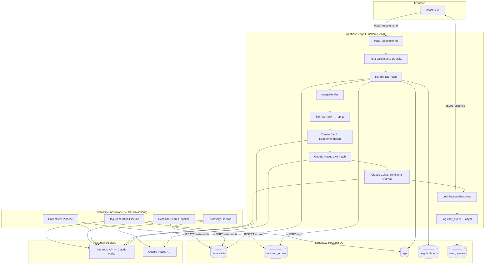
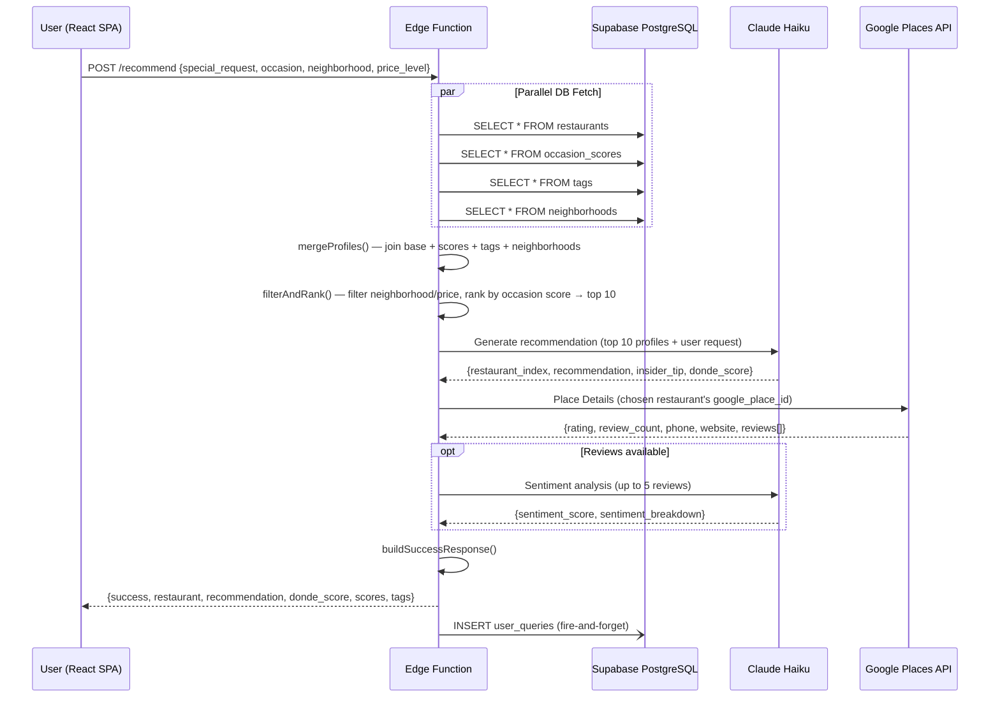
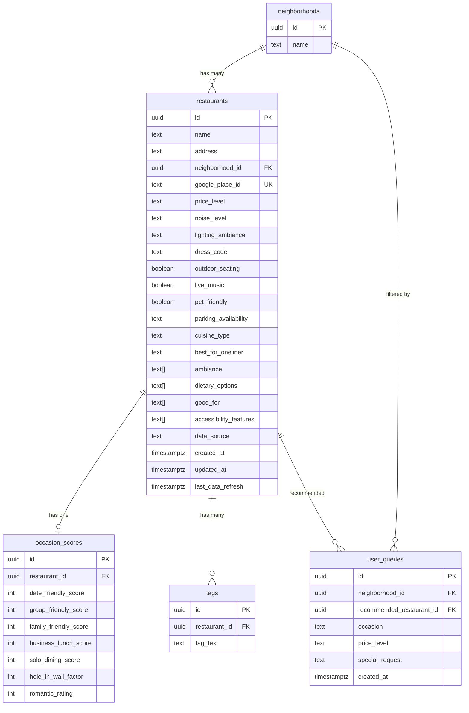
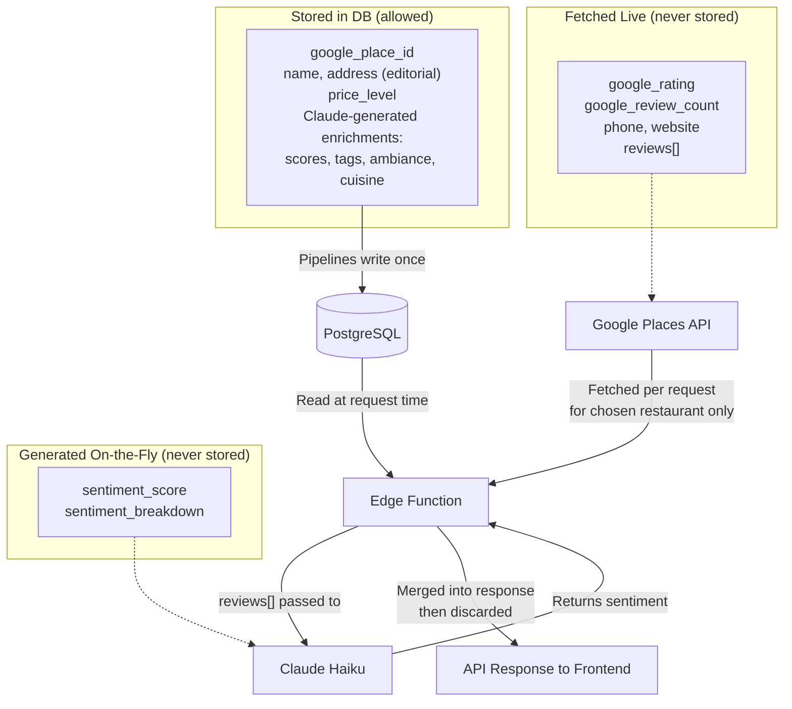
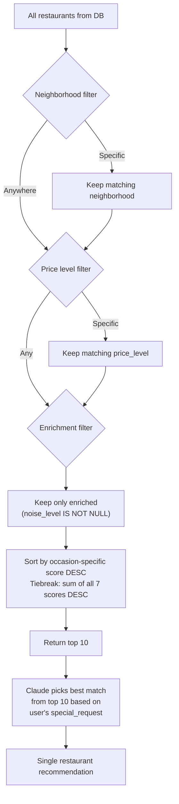
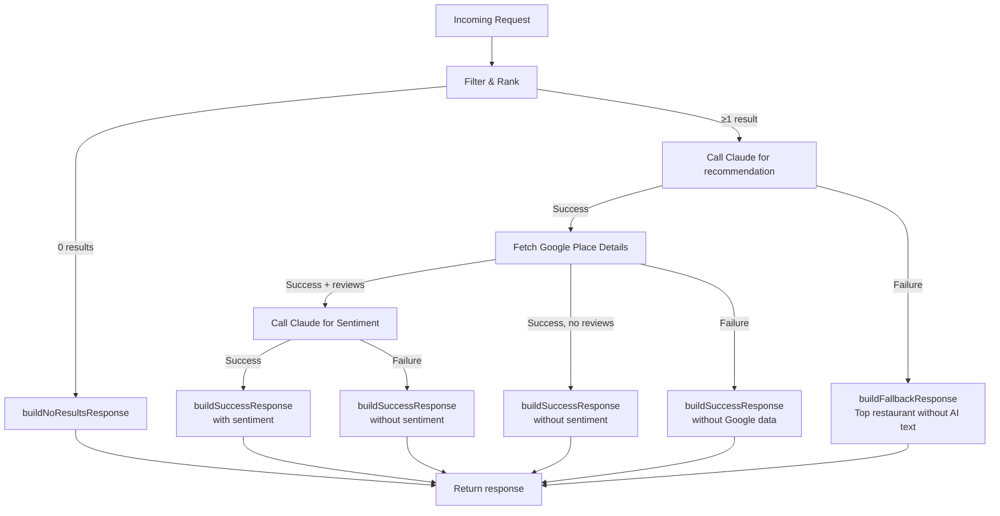
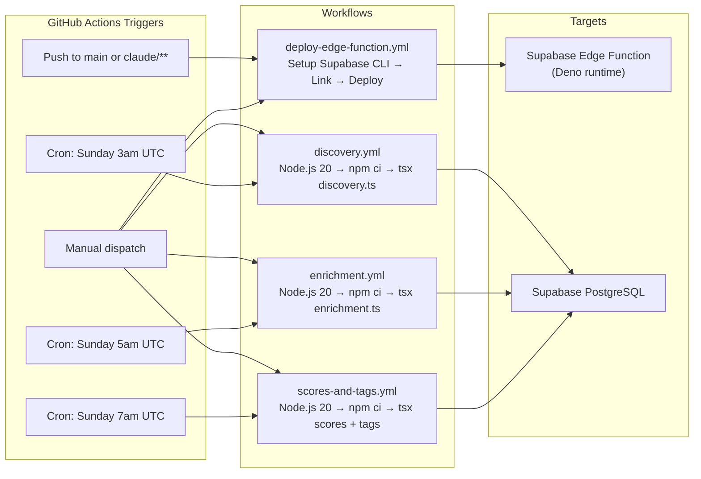

# DondeAI Backend — System Architecture

## High-Level Overview



---

## Recommendation Request Flow



---

## Data Pipeline Schedule (Weekly, Sundays)

```mermaid
gantt
    title Weekly Pipeline Schedule (UTC)
    dateFormat HH:mm
    axisFormat %H:%M

    section Discovery
    Google Places text search + insert restaurants :p1, 03:00, 2h

    section Enrichment
    Claude enriches ambiance/dietary/accessibility :p2, 05:00, 2h

    section Scores & Tags
    Claude generates occasion scores (0-10)      :p3, 07:00, 1h
    Claude generates 3-6 tags per restaurant      :p4, 07:00, 1h
```

```mermaid
flowchart LR
    subgraph "Sunday 3:00 AM UTC"
        D1[Load neighborhoods from DB]
        D2["Text search Google Places<br/>(14 neighborhoods × 6 cuisines = 84 queries)"]
        D3[Deduplicate by place_id]
        D4[Fetch place details for new places]
        D5[Map to neighborhood via ZIP/coords]
        D6[INSERT new restaurants]
        D1 --> D2 --> D3 --> D4 --> D5 --> D6
    end

    subgraph "Sunday 5:00 AM UTC"
        E1["Find restaurants with<br/>noise_level IS NULL"]
        E2["Claude enriches batches of 10:<br/>noise, lighting, dress code,<br/>dietary, accessibility, ambiance"]
        E3[UPDATE restaurants]
        E1 --> E2 --> E3
    end

    subgraph "Sunday 7:00 AM UTC"
        S1["Find restaurants without<br/>occasion_scores rows"]
        S2["Claude scores batches of 10:<br/>7 occasion dimensions (0-10)"]
        S3[INSERT occasion_scores]
        S1 --> S2 --> S3

        T1["Find restaurants<br/>without tags"]
        T2["Claude generates 3-6 tags<br/>per restaurant in batches"]
        T3[INSERT tags]
        T1 --> T2 --> T3
    end

    D6 -.->|"2h gap"| E1
    E3 -.->|"2h gap"| S1
    E3 -.->|"2h gap"| T1
```





---

## Database Schema



---

## Google API Compliance Model

Per Google Maps Platform ToS Section 3.2.3, only `place_id` may be stored indefinitely.



---

## Occasion Score Mapping

| User Occasion     | DB Score Column         |
|-------------------|-------------------------|
| Date Night        | date_friendly_score     |
| Group Hangout     | group_friendly_score    |
| Family Dinner     | family_friendly_score   |
| Business Lunch    | business_lunch_score    |
| Solo Dining       | solo_dining_score       |
| Special Occasion  | romantic_rating         |
| Treat Myself      | solo_dining_score       |
| Adventure         | hole_in_wall_factor     |
| Chill Hangout     | group_friendly_score    |
| Any (default)     | date_friendly_score     |

---

## Ranking Algorithm



---

## Fallback Strategy



---

## Deployment & CI/CD



---

## Project File Structure

```
dondeBackend/
├── supabase/
│   ├── functions/
│   │   └── recommend/
│   │       ├── index.ts                    # Main Edge Function handler
│   │       └── _shared/
│   │           ├── types.ts                # TypeScript interfaces
│   │           ├── cors.ts                 # CORS headers & JSON helpers
│   │           ├── response-builder.ts     # Response construction
│   │           ├── scoring.ts              # Ranking & prompt building
│   │           ├── claude.ts               # Anthropic API client
│   │           ├── google-places.ts        # Google Places live fetch
│   │           └── supabase.ts             # Supabase DB client
│   └── migrations/
│       ├── *_cleanup_schema.sql
│       ├── *_add_indexes.sql
│       ├── *_google_compliance.sql
│       ├── *_add_cuisine_type.sql
│       └── *_seed_neighborhoods.sql
├── scripts/
│   ├── lib/
│   │   ├── config.ts                       # Neighborhoods, cuisines, coords
│   │   ├── claude.ts                       # Node.js Anthropic client
│   │   ├── google-places.ts                # Google Places API wrapper
│   │   ├── supabase.ts                     # Admin Supabase client
│   │   ├── batch.ts                        # Batch processor utility
│   │   └── types.ts                        # Shared pipeline types
│   └── pipelines/
│       ├── discovery.ts                    # Google Places restaurant discovery
│       ├── enrichment.ts                   # Claude ambiance enrichment
│       ├── generate-occasion-scores.ts     # Claude occasion scoring
│       └── generate-tags.ts                # Claude tag generation
├── .github/workflows/
│   ├── deploy-edge-function.yml            # Edge Function deployment
│   ├── discovery.yml                       # Weekly discovery (Sun 3am)
│   ├── enrichment.yml                      # Weekly enrichment (Sun 5am)
│   └── scores-and-tags.yml                 # Weekly scores & tags (Sun 7am)
├── _archive/                               # Reference docs & original workflows
├── CLAUDE.md                               # Project instructions
└── docs/
    └── system-architecture.md              # This file
```
