# DondeAI Backend — System Architecture

## High-Level Overview


---

## Recommendation Request Flow

Every request goes through Claude for a personalized recommendation with live Google review sentiment analysis.


---

## Data Pipeline Schedule (Weekly, Sundays)

```mermaid
gantt
    title Weekly Pipeline Schedule (UTC)
    dateFormat HH:mm
    axisFormat %H:%M

    section Discovery
    Google Places text search + insert restaurants :p1, 03:00, 2h

    section Enrichment
    Claude enriches ambiance/dietary/accessibility :p2, 05:00, 2h

    section Scores & Tags
    Claude generates occasion scores (0-10)      :p3, 07:00, 1h
    Claude generates 3-6 tags per restaurant      :p4, 07:00, 1h
```




---

## Database Schema


---

## Google API Compliance Model

Per Google Maps Platform ToS Section 3.2.3, only `place_id` may be stored indefinitely.


---

## Occasion Score Mapping

| User Occasion     | DB Score Column         |
|-------------------|-------------------------|
| Date Night        | date_friendly_score     |
| Group Hangout     | group_friendly_score    |
| Family Dinner     | family_friendly_score   |
| Business Lunch    | business_lunch_score    |
| Solo Dining       | solo_dining_score       |
| Special Occasion  | romantic_rating         |
| Treat Myself      | solo_dining_score       |
| Adventure         | hole_in_wall_factor     |
| Chill Hangout     | group_friendly_score    |
| Any (default)     | date_friendly_score     |

---

## Ranking Algorithm

Two-phase ranking: the RPC does broad server-side sorting, then TypeScript applies special_request-aware re-ranking before Claude makes the final pick.


### Keyword Boost Details (`computeBoost`)

The boost score rewards restaurants whose attributes match the user's `special_request`:

| Match Type | Points | Example |
|-----------|--------|---------|
| Cuisine match | +3.0 | "sushi" matches `cuisine_type: "Japanese"` |
| Tag match (per tag) | +1.5 | "rooftop" matches tag "rooftop" |
| Feature match (per feature) | +1.5 | "outdoor" matches `outdoor_seating: true` |

Keyword dictionaries: 14 cuisine categories, 17 tag categories, 3 boolean features (outdoor_seating, live_music, pet_friendly).

---

## Fallback Strategy


---

## Key Optimizations

### 1. RPC-Based Ranking (Single DB Round-Trip)

The `get_ranked_restaurants()` PostgreSQL function replaces 4 separate queries with a single server-side operation:

```
-- Old approach: 4 queries
SELECT * FROM restaurants;
SELECT * FROM occasion_scores;
SELECT * FROM tags;
SELECT * FROM neighborhoods;
-- Then merge, filter, rank in application code

-- New approach: 1 RPC call
SELECT * FROM get_ranked_restaurants(p_neighborhood, p_price_level, p_occasion, p_limit);
-- Server-side JOIN + filter + rank, returns ready-to-use profiles
```

### 2. Merged Claude Call (Recommendation + Sentiment)

Single Claude call combines recommendation generation and sentiment analysis:
- Receives: top 10 restaurant profiles + user request + Google reviews for top restaurants
- Returns: restaurant pick, recommendation text, insider_tip, relevance_score, sentiment_score, sentiment_breakdown
- Prompt caching enabled via `cache_control: { type: "ephemeral" }` on system prompt

### 3. Parallel Google Fetches

During the Claude API call, Google Place Details are fetched in parallel for the top 3 ranked restaurants. If Claude picks from the top 3, the pre-fetched data is reused.

---

## Deployment & CI/CD


---

## Project File Structure

```
dondeBackend/
├── supabase/
│   ├── functions/
│   │   └── recommend/
│   │       ├── index.ts                    # Main Edge Function handler
│   │       └── _shared/
│   │           ├── types.ts                # TypeScript interfaces
│   │           ├── cors.ts                 # CORS headers & JSON helpers
│   │           ├── response-builder.ts     # Response construction (4 builders)
│   │           ├── scoring.ts              # Ranking, keyword boost, donde_match, prompt building
│   │           ├── claude.ts               # Anthropic API client (prompt caching)
│   │           ├── google-places.ts        # Google Places live fetch
│   │           └── supabase.ts             # Supabase DB client
│   └── migrations/
│       ├── *_cleanup_schema.sql            # Remove Yelp/legacy columns, merge dietary
│       ├── *_add_indexes.sql               # Query performance indexes
│       ├── *_google_compliance.sql         # Drop stored Google data columns
│       ├── *_add_cuisine_type.sql          # Add cuisine_type column
│       ├── *_seed_neighborhoods.sql        # 14 Chicago neighborhoods
│       ├── *_optimization.sql              # RPC function, insider_tip
│       ├── *_fix_rpc_null_neighborhood.sql # Handle NULL neighborhood_id in RPC
│       ├── *_rename_donde_score_to_match.sql # Rename donde_score → donde_match
│       ├── *_fix_occasion_scores_id_default.sql # Add uuid_generate_v4() default
│       ├── *_fix_tags_id_default.sql       # Add uuid_generate_v4() default
│       ├── *_drop_pre_recommendations.sql  # Removed pre-recommendations table
│       └── *_rpc_exclude_and_shuffle.sql   # Add random() tiebreaker + dynamic limit to RPC
├── scripts/
│   ├── lib/
│   │   ├── config.ts                       # Neighborhoods, cuisines, coords, ZIP mapping
│   │   ├── claude.ts                       # Node.js Anthropic client
│   │   ├── google-places.ts                # Google Places API wrapper
│   │   ├── supabase.ts                     # Admin Supabase client (service role)
│   │   ├── batch.ts                        # Batch processor utility
│   │   └── types.ts                        # Shared pipeline types
│   └── pipelines/
│       ├── discovery.ts                    # Google Places restaurant discovery
│       ├── enrichment.ts                   # Claude ambiance/dietary/insider_tip enrichment
│       ├── generate-occasion-scores.ts     # Claude occasion scoring (7 dimensions)
│       ├── generate-tags.ts                # Claude tag generation (3-6 per restaurant)
│       ├── backfill-new-fields.ts          # One-time backfill for new columns
│       └── populate-all.ts                 # Orchestrator: runs all pipelines sequentially
├── .github/workflows/
│   ├── deploy-edge-function.yml            # Edge Function deployment (push + manual)
│   ├── discovery.yml                       # Weekly discovery (Sun 3am)
│   ├── enrichment.yml                      # Weekly enrichment (Sun 5am)
│   └── scores-and-tags.yml                 # Weekly scores & tags (Sun 7am)
├── _archive/                               # Reference docs & original workflows
├── CLAUDE.md                               # Project instructions
└── docs/
    ├── system-architecture.md              # This file
    └── api-field-mapping.md                # Complete request/response field mapping
```
